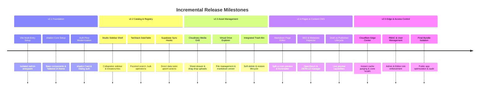

# Product Requirements Document (PRD): Staged Migration to Studio Admin Architecture (v2.1 – v2.5)

**Document ID:** `PRD-2026-V2-MIGRATION`  
**Target Application:** `roryskagenart.com`  
**Current Baseline:** v2.0.0 (Monolithic SPA, Hybrid Express/Vite, In-Memory/Supabase Engine)  
**Target Milestone:** v2.5.0 (Decoupled Public Fine Art Gallery & Shadcn Studio CMS / Cloudflare Admin)  
**Owner:** Rory Skagen Studio Engineering  
**Status:** Approved / In Staging  
**Last Updated:** September 10, 2026  

---

## 1. Executive Summary & Vision

### 1.1 Objective
Transform `roryskagenart.com` from an all-in-one monolithic Single Page Application into a cleanly decoupled, high-performance web system consisting of:
1. **Public Fine Art Gallery (`/`)**: A lightning-fast, zero-admin-bundle showcase optimized for collectors, curators, search engines, and Core Web Vitals (LCP < 1.2s, INP < 100ms).
2. **Studio Administration Dashboard (`/admin`)**: A modern, secure, full-featured content management suite modeled after Supabase Studio and modern CMS platforms, constructed with **standard shadcn/ui components** and **Tailwind CSS**.

### 1.2 Guiding Architectural Principles
* **Zero Disruption to Live Gallery:** Public collectors must experience zero downtime or degraded performance at any point during minor releases.
* **Strict Bundle Isolation:** Administrative code, Cloudinary management SDKs, file parsers, and table heavyweights must never leak into the public visitor JavaScript bundle.
* **Standard / Core shadcn Tooling:** Adopt canonical shadcn/ui building blocks (`sidebar`, `data-table` with TanStack Table v8, `dialog`, `sheet`, `command` palette, `form` with Zod validation, `sonner` notifications) rather than ad-hoc custom modals.
* **Progressive Delivery (Trunk-Based with Semantic Releases):** Deliver discrete, production-ready increments across minor versions (v2.1 $\rightarrow$ v2.5) via GitHub Projects, protected branch PRs, and automated semantic versioning.

---

## 2. Improved Strategy & Best-Practice Framework

### 2.1 Refined Migration Strategy
Rather than attempting a high-risk "rewrite everything" refactor, we employ the **Strangler Fig Pattern**:
1. Keep current APIs and data stores intact while establishing a distinct `/admin` entrypoint.
2. Progressively migrate one subsystem per release into standard shadcn primitives.
3. Once all admin views are running in `/admin`, eliminate obsolete code from the public app bundle.

```
+-------------------------------------------------------------------------------+
|                             Reverse Proxy / Express                           |
+---------------------------------------+---------------------------------------+
                                        |
                 +----------------------+----------------------+
                 |                                             |
                 v                                             v
       [ / (Public Gallery) ]                        [ /admin (Studio CMS) ]
  * Optimized Public Bundle                     * Isolated Admin Entrypoint
  * Editorial Design & Heritage                 * Canonical shadcn/ui Design System
  * Collector Inquiries & Catalog               * Supabase RBAC & Cloudflare Controls
```

### 2.2 Standard shadcn/ui Tooling Stack

| shadcn Component | Primary Studio Admin Use Case | Replaces Current Legacy Component |
| :--- | :--- | :--- |
| **`SidebarProvider` / `Sidebar`** | Primary studio navigation, collapsible rail, breadcrumbs, user badge | Custom top navbar links & hash switches in `Navbar.tsx` |
| **`DataTable` (TanStack Table v8)** | Sortable, paginated, faceted catalog management with bulk actions | Monolithic table in `MasterRegistryTable.tsx` |
| **`Command` (`cmdk`)** | Global quick-actions (`Cmd+K` / `Ctrl+K`) for artworks, pages, and search | Scattered search inputs and manual routing |
| **`Sheet` / `Dialog`** | Asset inspectors, Cloudinary upload drawers, quick edits | Full-screen overlays & custom modals (`AdminLoginModal.tsx`) |
| **`Form` + `zod`** | Type-safe form validation for artwork metadata, SEO, and contact details | Uncontrolled inputs and raw state dictionaries |
| **`Sonner`** | Unified status toasts for Supabase sync, uploads, and cache purges | Custom inline banner alerts |
| **`Tabs` / `Card` / `Badge`** | Studio layout structuring, availability badges, series grouping | Custom Tailwind utility wrappers |

---

## 3. Phased Release Roadmap (v2.1 – v2.5)



---

### Phase 1: v2.1.0 — Architecture Foundation & Dual-Entry Split

**Goal:** Establish the foundation without touching or breaking any existing public gallery functionality.

#### Scope of Work:
1. **Multi-Page Entry Architecture (Vite):**
   - Configure `vite.config.ts` with rollup input rollup entries:
     - `index.html` (public gallery)
     - `admin.html` (served on `/admin` rewrite)
   - Ensure development and production builds cleanly partition output bundles.
2. **Initialize Canonical shadcn/ui:**
   - Install core dependencies: `clsx`, `tailwind-merge`, `class-variance-authority`, `lucide-react`, `radix-ui` primitives.
   - Configure `components.json` compatible with Vite and Tailwind v4 CSS variables.
   - Add base primitives: `button`, `card`, `input`, `label`, `dialog`, `badge`, `sonner`.
3. **Authentication Modernization:**
   - Migrate [AdminLoginModal.tsx](file:///c:/Users/jaden.black/dev.local/clients/roryskagen/roryskagenart.com/src/components/AdminLoginModal.tsx) and [AuthGateView.tsx](file:///c:/Users/jaden.black/dev.local/clients/roryskagen/roryskagenart.com/src/components/AuthGateView.tsx) to standard shadcn `Card` + `Form` with Zod schema validation.
   - Add server-side `/admin` redirect middleware in [server.ts](file:///c:/Users/jaden.black/dev.local/clients/roryskagen/roryskagenart.com/server.ts) to verify session cookies before serving administrative routes.

#### Success Criteria & Verification:
- [ ] Navigating to `/admin` loads the new shadcn shell.
- [ ] Navigating to `/` loads the public gallery with zero regression.
- [ ] Public bundle size is unaffected or reduced.
- [ ] Authentication passes via both manual password and 1-click Studio bypass.

---

### Phase 2: v2.2.0 — Studio Shell & Master Registry Migration

**Goal:** Provide a world-class catalog management experience matching modern headless CMS standards.

#### Scope of Work:
1. **Canonical Studio Layout:**
   - Implement `SidebarProvider`, `Sidebar`, `SidebarHeader`, `SidebarContent`, `SidebarFooter`.
   - Add studio status indicator (PostgreSQL connection health, Cloudinary link, sync status).
   - Implement Command Palette (`cmdk`) triggered via `⌘K` / `Ctrl+K` to search any artwork or jump between sections.
2. **Catalog Table Modernization (TanStack Table v8 + shadcn `DataTable`):**
   - Replace [MasterRegistryTable.tsx](file:///c:/Users/jaden.black/dev.local/clients/roryskagen/roryskagenart.com/src/components/MasterRegistryTable.tsx) with a high-performance `DataTable`:
     - Multi-column sorting (Title, Year, Price, Series, Created Date).
     - Faceted filters (Availability status, Gallery Series, Hero Slider presence, Trashed).
     - Column visibility toggling.
     - Row selection for bulk actions: *Sync Selected to Supabase*, *Bulk Archive*, *Bulk Trash*.
3. **Supabase Realtime Sync UI:**
   - Clean, non-intrusive status badges using `Sonner` toasts for sync confirmation and conflict resolution.

#### Success Criteria & Verification:
- [ ] All 100+ artwork records render with 60fps scrolling and instant search filtering.
- [ ] Bulk actions correctly mutate Supabase and local virtual filesystem states.
- [ ] Hero slider toggles reflect immediately on the public landing page.

---

### Phase 3: v2.3.0 — Asset Studio & Virtual Drive Explorer

**Goal:** Centralize digital asset operations (Cloudinary CDN & virtual drive markdown assets).

#### Scope of Work:
1. **Cloudinary Asset Manager Migration:**
   - Transform [CloudinaryManager.tsx](file:///c:/Users/jaden.black/dev.local/clients/roryskagen/roryskagenart.com/src/components/CloudinaryManager.tsx) into a shadcn `Sheet` (drawer) and full-page Asset Gallery.
   - Features: Drag-and-drop upload zone, copy transformed CDN URL (w/ thumbnail format presets), search by tags/folders, storage usage metrics.
2. **Virtual Drive & File Explorer:**
   - Refactor [DriveExplorer.tsx](file:///c:/Users/jaden.black/dev.local/clients/roryskagen/roryskagenart.com/src/components/DriveExplorer.tsx) into a collapsible file tree (`components/ui/tree` or accordion) paired with an embedded code/markdown editor.
   - Syntax-highlighted editing for `index.md`, `readme.md`, and individual artwork narratives.
3. **Trash & Recovery Lifecycle:**
   - Modernize [TrashView.tsx](file:///c:/Users/jaden.black/dev.local/clients/roryskagen/roryskagenart.com/src/components/TrashView.tsx) with clear retention indicators, single-click restoration, and permanent deletion confirmations requiring modal acknowledgment.

#### Success Criteria & Verification:
- [ ] Dragging an artwork JPEG into the dashboard uploads directly to Cloudinary and generates appropriate responsive thumbnails.
- [ ] Editing file narratives updates both local cache and Supabase backend.
- [ ] Restoring an item from the trash immediately re-indexes it into the active catalog.

---

### Phase 4: v2.4.0 — Dynamic Content Management (CMS) & Pages

**Goal:** Give the studio the ability to edit editorial content, biography, press notices, and contact info without touching code.

#### Scope of Work:
1. **Markdown Pages Studio:**
   - Refactor [PagesView.tsx](file:///c:/Users/jaden.black/dev.local/clients/roryskagen/roryskagenart.com/src/components/PagesView.tsx) into an editorial split-view workspace:
     - Left pane: Markdown source editor with frontmatter parser.
     - Right pane: Live styled preview mirroring public typography.
2. **Metadata & SEO Management:**
   - Add page-level SEO controls: Title, meta description, OpenGraph preview card, and social share image selector.
3. **Draft vs. Published Workflow:**
   - Support `status: 'draft' | 'published'` in page frontmatter and database records.
   - Add a "Preview in Gallery" button with an ephemeral preview token.

#### Success Criteria & Verification:
- [ ] Editing the "About Rory" page in `/admin/pages/about` updates the public `/about` page instantly upon publish.
- [ ] Draft pages remain inaccessible to public visitors.

---

### Phase 5: v2.5.0 — Cloudflare Edge Integration, Access Control & Final Decoupling

**Goal:** Enterprise-grade edge management, multi-user permissions, and complete code detachment.

#### Scope of Work:
1. **Cloudflare Edge Management Module:**
   - Dashboard tab for edge controls via Cloudflare REST API:
     - **1-Click Purge Everything / Selective URL Purge** (e.g., when catalog updates).
     - Cache Hit Ratio and Bandwidth diagnostics.
     - DNS & SSL status check.
2. **Role-Based Access Control (RBAC):**
   - Differentiate user roles via Supabase Auth + RLS:
     - **Admin (Rory / Lead)**: Full access (deletion, Cloudflare purge, user provisioning).
     - **Studio Assistant / Editor**: Can edit descriptions, add works, manage tags, cannot purge edge or delete users.
3. **Complete Decoupling & Legacy Cleanup:**
   - Remove legacy admin components from public `src/components` tree.
   - Run bundle analyzer (`rollup-plugin-visualizer`): verify that public gallery bundle contains 0KB of admin/table/editor code.

#### Success Criteria & Verification:
- [ ] Triggering "Purge Cache" from `/admin` invalidates Cloudflare edge within 500ms.
- [ ] Unauthenticated requests to `/admin` or `/api/admin/*` are rejected with clean redirects or 401 JSON.
- [ ] Public site PageSpeed Score $\ge$ 95 across Mobile and Desktop.

---

## 4. GitHub Project, PR & Release Strategy

### 4.1 GitHub Project Board Structure
A dedicated GitHub Project (**"Rory Skagen Studio CMS Migration"**) will track progress with automated workflow states:

| Column | Description | Automation Trigger |
| :--- | :--- | :--- |
| **Backlog** | Defined user stories and technical tasks mapped to v2.1–v2.5 | New issues assigned to milestone |
| **Ready for Dev** | Tasks with completed acceptance criteria | Prioritized by lead engineer |
| **In Progress** | Actively being developed on feature branches | PR opened or branch linked |
| **Review / QA** | PR under review; deployed to Vercel/Cloudflare preview | PR marked "Ready for Review" |
| **Done** | Merged into `main` and released in semantic tag | PR merged |

### 4.2 Branching Model & PR Standards
* **Branch Convention:**
  - `feat/v2.1-vite-multi-entry`
  - `feat/v2.2-shadcn-datatable`
  - `feat/v2.3-cloudinary-asset-sheet`
  - `feat/v2.4-pages-markdown-cms`
  - `feat/v2.5-cloudflare-edge-rbac`
* **Pull Request Requirements:**
  - Mandatory PR template including: Summary, Visual/Loom Demo, Test Evidence, Security & Bundle Size Check.
  - Automated PR checks: `npm run lint` (`tsc --noEmit`), build verification, preview deployment on Vercel.

### 4.3 Semantic Versioning & Release Tagging
Each stage maps to a formal GitHub Release:
- `v2.1.0`: Foundation release (Dual-entry, shadcn setup)
- `v2.2.0`: Catalog studio release (TanStack DataTable, Sidebar shell)
- `v2.3.0`: Digital Asset release (Cloudinary Sheet, File tree, Trash view)
- `v2.4.0`: Dynamic CMS release (Markdown Pages, SEO editor)
- `v2.5.0`: Production Edge & Decoupled Architecture release (Cloudflare controls, RBAC, bundle purification)

---

## 5. Risk Assessment & Mitigation Matrix

| Risk | Impact | Probability | Mitigation Strategy |
| :--- | :---: | :---: | :--- |
| **Tailwind v4 / shadcn styling collisions** | Med | Med | Use standard CSS variables theme format (`@theme inline`) without legacy `tailwind.config.js` overrides. |
| **Public bundle regression** | High | Low | Rollup bundle analyzer automated in CI; fail build if public bundle exceeds 180KB gzip. |
| **Data out-of-sync between Supabase and local JSON** | Med | Med | Preserve the existing `POST /api/artworks/batch-sync` bidirectional backup mechanism during all phases. |
| **Session cookie dropping across subpaths** | Med | Low | Set `Path=/` and `SameSite=Lax` with `HttpOnly` on authentication session cookies. |

---

## 6. Implementation Readiness Checklist

- [x] Baseline v2.0 application stable and verified.
- [x] Express backend configured with Supabase and Cloudinary SDKs.
- [x] GitHub Project board and milestone tracking configured.
- [x] Next immediate step: Execute Phase 1 (v2.1.0) branch creation.
